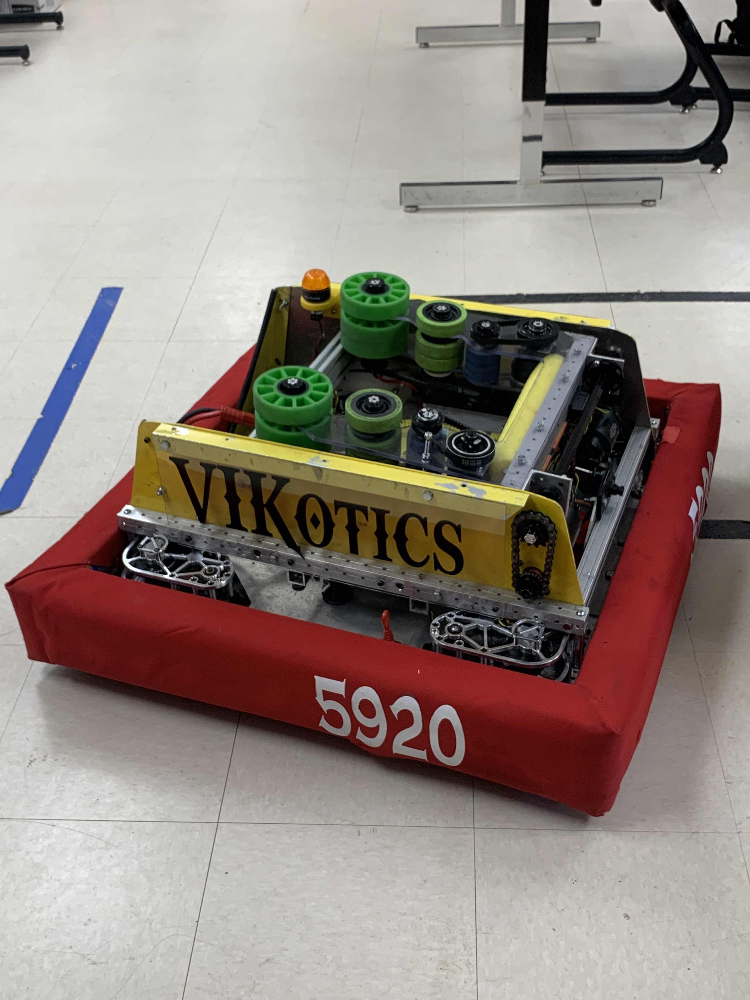
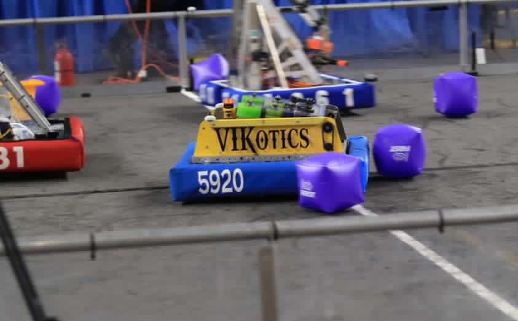

**FRC 5290 - VIKotics**

---

# 2023 Robot Code: Lil' Cheese

---

This repository contains source code for the VIKotics robot Lil' Cheez fielded
for the 2023 "Charged Up!" FRC competition.

## Repo Organization

Source Code is organized under [src/main/java/frc/](./src/main/java/frc) in the following subdirectories:

- [lib/](./src/main/java/frc/lib): third-party sources and common classes shared across robot
code modules (e.g. Swerve Drive, Joystick, etc.).
- [robot/](./src/main/java/frc/robot): sources that directly implement robot subsystems and runtime routines.

## Documentation
* [Robot Code](./src/main/java/frc/robot/robot-code.md)
* [Autonomous Routines](./src/main/java/frc/robot/autos/doc/auto-routines.md)

## Useful Links

- [Discussion about chase tag](https://www.chiefdelphi.com/t/photonvision-beta-2023-apriltags/415626/156?u=amicus1)
- [Chase Tag Command](https://github.com/STMARobotics/swerve-test/blob/b11cc5ab3693b698eed8f6fc38a60813d21e2f45/src/main/java/frc/robot/commands/ChaseTagCommand.java)
- [Mechanical Advantage April Tag Vision](https://github.com/Mechanical-Advantage/RobotCode2023/tree/main/src/main/java/org/littletonrobotics/frc2023/subsystems/apriltagvision)
