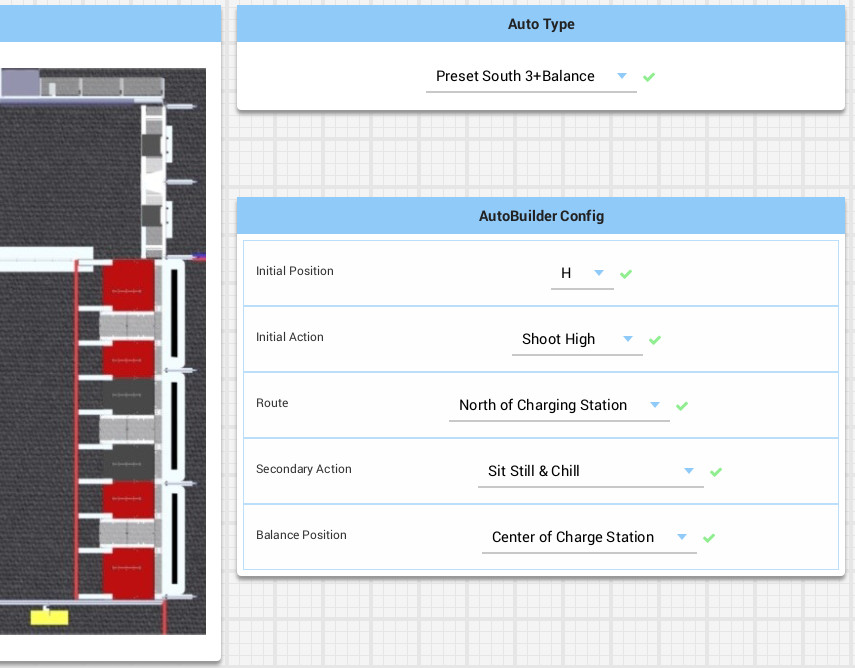

**FRC 5290 - VIKotics**

---

# Auto-Builder: Generated Autonomous Routines

The AutoBuilder is a set of code modules that interpret several Dashboard user
interface control elements (called widgets) offering choices for where the robot
should move and what it should do during the autonomous period.  The values of
Dashboard widgets values are passed to AutoBuilder code modules, that generate
corresponding trajectories to move the robot along the selected path and combine
them with commands used to carry out other behaviors including shooting cargo
and balancing.

The Auto-Builder is intended to provide the robot drive team with a flexible set
of options during the autonomous period, enabling them to work alongside the
autonomous routines of other alliance robots.  Choice widgets used to build auto
routines include:

## Auto Choosers

### Auto Type

The Auto Type chooser selects between autonomous routines generated using the
Auto-builder and other [preset auto routines](./preset-auto-routines.md).  When
the selected choice is set to _AutoBuilder_ , the remaining chooser widgets are
used to configure the detailed actions in the generated auto routine.
Otherwise, the remaining chooser widgets are ignored.  Options in this chooser
correspond to elements of the `AutoType` enum supplied in
[`AutoConstants.java`](../AutoConstants.java).

### Initial Position

This chooser sets the grid position (A-I) where the robot is located when the
auto routine begins.  Options in this chooser correspond to elements of the
`GridPosition` enum supplied in [`AutoConstants.java`](../AutoConstants.java).
This enum includes methods that supply additional information about each grid
position, such as `getPose()` which returns the expected robot pose at the grid
position (including heading/rotation) and `getPosition()` which is used to
obtain the x/y coordinates of the grid position.

### Initial Action

The Initial Action chooser is used to specify the initial action taken in the
generated auto routine to shoot a pre-loaded cube.  Choices include shooting the
cube into the low, medium, or high grid, or _Bump Score_.  Options in the
chooser correspond to elements of the `InitialAction` enum supplied in
[`AutoConstants.java`](../AutoConstants.java).

For the _Bump Score_
option, the cube is balanced on a part of the robot on the side nearest the
grids.  When the auto starts, the robot lurches forward for a short distance
(approximately half a meter), then stops.  This causes the cube to fall between
the robot and the grid.  After stopping, the robot drives backward, bumping the
cube past the scoring line in the low grid position.

### Route

The Route chooser determines the path the robot travels to escape the Community
after shooting the pre-loaded cube.  Options include sending the robot North,
South, or _over_ the Charging station.  These options correspond to elements of
the `EscapeRoute` enum supplied in [`AutoConstants.java`](../AutoConstants.java).

To move the robot out of the community, a series of waypoints is assembled based
on the selected route.  This series begins with a waypoint at the robot's
initial pose, continues through a corner waypoint built from the X coordinate of
the initial pose and the Y coordinate of the center of the selected route
(referred to as a `Lane` in source code).  The waypoint series ends with a
waypoint given for the selected route by the `Endpoint` enum in
[`AutoConstants.java`](../AutoConstants.java).  Additionally, a
`PathPlannerTrajectory` object is built from this waypoint series.  It is used
only to display the path on the Dashboard, however, and is not used to drive the
robot.

### Secondary Action

This chooser allows the drive team to specify an action to be taken once the
robot has completed moving along the generated path out of the community.
Available options include _Balance on Charge Station_, in which the robot moves
to the Charge Station and balances, or _Sit Still & Chill_ where the robot stays
put and takes no additional action.  These options are captured in the
`SecondaryAction` enum in [`AutoConstants.java`](../AutoConstants.java).

### Balance Position

This chooser is only used when _Balance on Charge Station_ is selected in the
Secondary Action chooser.  It allows the drive team to specify the position on
the Charge Station where the robot will position itself to balance.  It is
intended to allow for the situation where the alliance wants multiple robots to
balance during the Autonomous period.  The balance position can be configured to
be the North or South end or at the center of the Charge Station.  Choices in
this chooser correspond to elements of the `BalancePosition` enum in
[`AutoConstants.java`](../AutoConstants.java).  The enum includes the method
`getBalancePosition()`, which is used to access the x/y location of the balance
position for a given element.

## Autonomous Command Generation

Generation of the final AutoBuilder routine is performed by the
[`AutoRoutineBuilder`](../AutoBuilder/AutoRoutineBuilder.java) class.  An object
of this class is instantiated in the [`AutoDashboardTab`](../AutoDashboardTab.java),
and is used as the top-level entry point for assembling an overall command to
carry out the auto.  The overall command is composed of sub-commands built by a
set of classes derived from [`AutoStrategy`](../AutoBuilder/AutoStrategy.java),
each of which includes a `getCommand()` method to return a command, a
`getTrajectories()` method to return a `Trajectory` describing the path of the
robot, and a `getFinalPose()` method, which returns the pose of the robot upon
completion of the sub-command.  The following `AutoStrategy` classes implement
generation of pieces of the AutoBuilder autonomous routine:

| Class | Description |
|:------|:------------|
| [`InitialActionStrategy.java`](../AutoBuilder/InitialActionStrategy.java) | Generates command(s) to shoot the pre-loaded cube |
| [`EscapeStrategy.java`](../AutoBuilder/EscapeStrategy.java) | Generates a command and trajectory to move the robot out of the Community using a set of waypoints and the [`DriveToPose`](../../commands/Drive2Pose.java) command |
| [`BalanceStrategy.java`](../AutoBuilder/BalanceStrategy.java) | Generates a command and trajectory to move the robot onto the Charge Station and balance |

The `AutoRoutineBuilder` creates instances of the `AutoStrategy` classes and
calls their `getCommand()` methods in order, combining the returned commands into
a command sequence.  The resulting command sequence is returned when the object's
`build()` method is called.  A list of `PathPlannerTrajectory` objects
corresponding to paths traveled in the command are returned from a call to the
`getTrajectories()` method.
