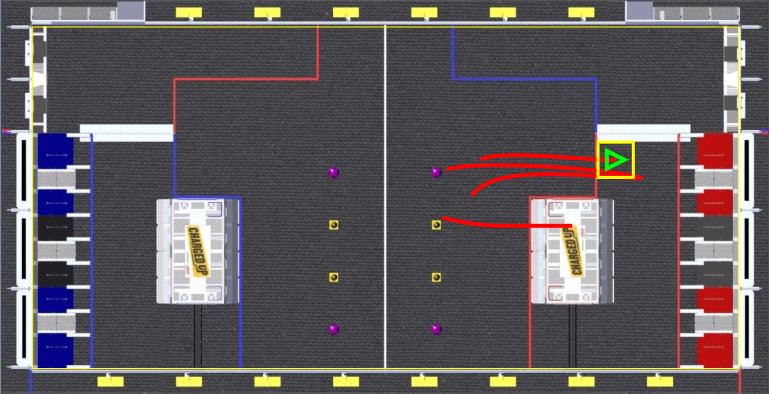
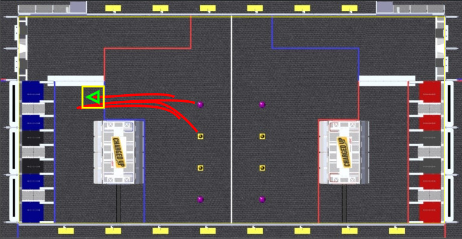
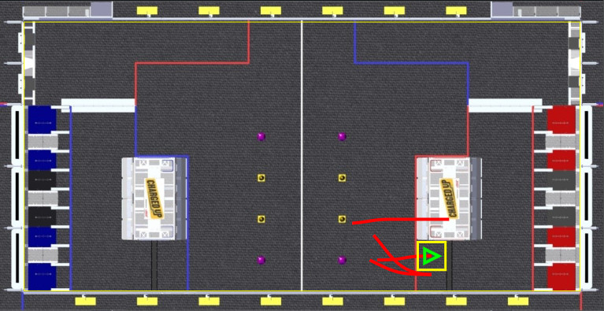
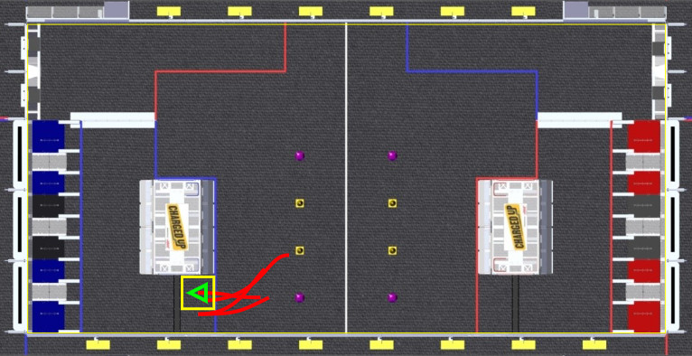

**FRC 5290 - VIKotics**

---

# Preset Autonomous Routine Descriptions

## North Presets

Two preset auto routines, `North 3+Balance` and `North 3+chill` provide a 3-cube
auto on the North side of the Charging Station.  Both score a link of cubes
across the low positions of Substation Grids in positions `G`, `H`, and `I`.
They differ only in whether the final position of the robot is balancing on the
Charging Station or not.  Steps carried out by these auto routines are:

1. Shoot a pre-loaded cube into the low grid at position `I`.
1. Move close to the preset cube `C1`.
1. Use camera vision to move to and intake `C1`.
1. Move back into community and shoot `C1` into the low grid at position `H`.
1. Move close to the preset cube `C2`.
1. Use camera vision to move to and intake `C2`.
1. Move to the Charging Station and balance (`North 3+Balance`) or move to a
position North of the Charging Station (`North 3+chill`).
1. Shoot `C2` into the low grid at position `G`.

### North 3+Balance Auto Routine Trajectories

### North 3+chill Auto Routine Trajectories

## South Presets

Two preset auto routines, `South 3+Balance` and `South 3+chill` provide a 3-cube
auto on the South side of the Charging Station.  Both take advantage of the
robot's relatively small footprint by beginning with the robot positioned at the
cable protector.  They then proceed to score a link of cubes across the low
positions of Substation Grids in positions `A`, `B`, and `C`.  The two routines
differ only in whether the final position of the robot is balancing on the
Charging Station or positioned South of the Charging Station.  Steps carried out
by the South auto routines are:

1. Shoot a pre-loaded cube into the low grid at position `A`.
1. Move close to the preset cube `C4`.
1. Use camera vision to move to and intake `C4`.
1. Move back into community and shoot `C4` into the low grid at position `B`.
1. Move close to the preset cube `C3`.
1. Use camera vision to move to and intake `C3`.
1. Move to the Charging Station and balance (`South 3+Balance`) or move to a
position South of the Charging Station (`South 3+chill`).
1. Shoot `C3` into the low grid at position `C`.

### South 3+Balance Auto Routine Trajectories

### South 3+chill Auto Routine Trajectories

## Preset Autonomous Routine Implementations

Preset auto routines are each created using a corresponding builder class:

| Preset | Builder Class |
|--------|---------------|
| `North 3+Balance` | [`North3PlusBalanceAutoBuilder`](../src/main/java/frc/robot/autos/Preset/North3PlusBalanceAutoBuilder.java) |
| `North 3+chill`   | [`North3PlusChillAutoBuilder`](../src/main/java/frc/robot/autos/Preset/North3PlusChillAutoBuilder.java) |
| `South 3+Balance` | [`South3PlusBalanceAutoBuilder`](../src/main/java/frc/robot/autos/Preset/South3PlusBalanceAutoBuilder.java) |
| `South 3+chill`   | [`South3PlusChillAutoBuilder`](../src/main/java/frc/robot/autos/Preset/South3PlusChillAutoBuilder.java) |

The preset auto builder classes each implement a common
[`PresetBuilder` interface](../src/main/java/frc/robot/autos/Preset/PresetBuilder.java) that
provides methods used to obtain the auto routine's initial robot pose and trajectories (for
display on dashboard software).  Additionally, a `getCommand()` method returns a `Command`
that carries out all of the steps and logic in the auto routine.  The factory class,
`PresetAutoFactory` is used to obtain the `AutoBuilder` implementation for a corresponding member of
the [`AutoType` enum](../src/main/java/frc/robot/autos/AutoConstants).

During robot code initialization, the each preset auto builder class loads trajectories
from JSON files located in the [src/main/deploy/pathplanner/generatedJSON/](../src/main/deploy/pathplanner/generatedJSON)
directory, which are generated from corresponding [`.path`](../src/main/deploy/pathplanner) files
using [PathPlanner](https://github.com/mjansen4857/pathplanner).
